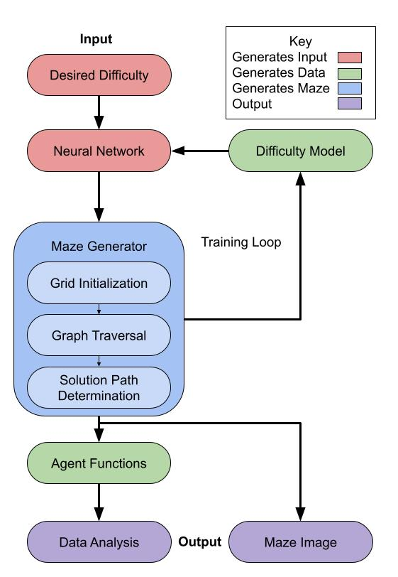

# Parameterized Maze Generation Algorithm for Specific Difficulty Maze Generation
## Project Description
I am working on creating a system for generating mazes of a specified difficulty using difficulty models. While there has been research into ranking existing maze generation algorithms by average resultant difficulty, there has been little in regards to using a single algorithm to generate mazes based on a difficulty input. To achieve this, I will be writing a maze algorithm with a number of parameters that will be used together to influence maze generation. A neural network will take the desired difficulty of the maze as an input, and output the parameters for the maze. Difficulty models will be used to analyze the maze and train the neural network. Finally, the final sets of mazes will have “real” difficulty measured by a number of agent functions.

Code for generating mazes of specific difficulty.
    (currently only generates mazes of specified size and a few traversal styles)
Uses g++ to compile.

## Architecture Diagram


## Softare Demonstration Video Link
https://youtu.be/TULqd7oy9F8

## Cloning

Call the following:<br>
- git clone git@code.cs.earlham.edu:ljpeach18/SpecificDifficultyMazeGenerator.git<br>
or
- git clone https://code.cs.earlham.edu/ljpeach18/SpecificDifficultyMazeGenerator.git


## Dependencies
- Tested on debian systems
- g++ compiler (at least version 6.3.0)
- Bash
- Python 3
- git
    - sudo apt install git-all
- build-essentials
    - sudo apt-get install build-essential
- pip
    - sudo apt install python3-pip
- Pillow
    - python3 -m pip install --upgrade Pillow

## Usage
- Examples assume the active directory is /SpecificDifficultyMazeGenerator.
- All inputs other than length and width must be between 0 and 1.
- Be mindful when typing inputs, as I currently do not have error detection for inputs.
- mazeUI is a user friendly interface for running each program available.
- mazeGen is the basic maze generation program.
- mazeDifficulty generates a maze, with added difficulty analysis (McClendon and Bellot et al.)
- mazeAgents generates a maze, with added difficulty analysis (DFS, BFS, A*, Greedy)
- testSuite runs a series of tests, measuring maze difficulty using both difficulty models, and agent functions.
- mazeVis is a tool used for converting mazes represented via text into more legible images.
```
    python3 code/mazeUI.py

    binaries/mazeGen [length] [width] [old node push location low] [old node push location high] [new node push location low] [new node push location high] [pop location low] [pop location high] [left bias] [straight bias] [right bias] [solution length rank ratio. Leave empty for no start and end points]

    binaries/mazeDifficulty [length] [width] [old node push location low] [old node push location high] [new node push location low] [new node push location high] [pop location low] [pop location high] [left bias] [straight bias] [right bias] [solution length rank ratio. Leave empty for standard maze generation]

    binaries/testSuite [length and width as one number. Only produces square mazes.]

    python3 code/mazeVis.py [maze text file] [output image file (should include .png extension)]
```

### Example run after calling make

    binaries/mazeGen 10 10 0 0 0 0 0 0 1 1 1 0 > outs/maze.txt ; python3 code/mazeVis.py outs/maze.txt outs/maze.png //(produces a 10 x 10 maze with DFS behavior, and converts to an image stored in outs/maze.png.)

    binaries/mazeGen [len] [wid] 0 0 0 0 0 0 1 1 1 0 //(Creates stack-like/DFS behavior)

    binaries/mazeGen [len] [wid] 1 1 1 1 0 0 1 1 1 0 //(Creates queue-like/BFS behavior)

    binaries/mazeGen [len] [wid] 0 1 0 1 0 1 1 1 1 0 //(Creates random behavior)

## Current Issues/Future Plans
- Maze Generation:
    - Intersection ratios are not implemented
    - Read in maze from file not implemented
- Difficulty Model:
    - Investigate alterations to models that account for super short solution path mazes (trivial adjacent start and end points)
- Neural Network not set up
- Implement exceptions
